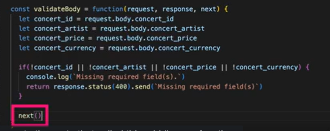
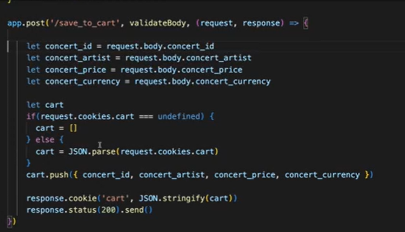
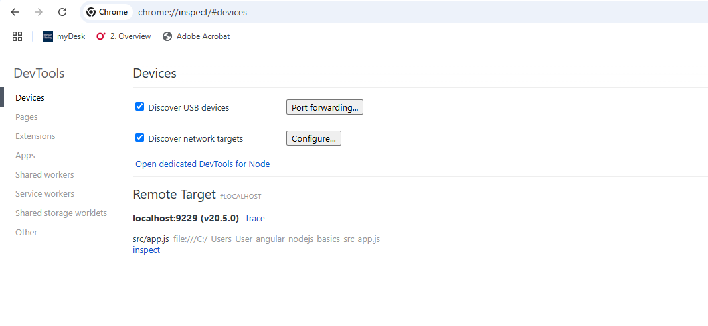
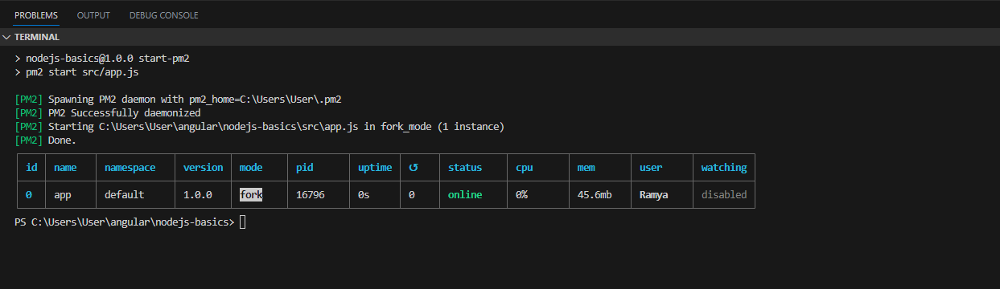

npm init
npm install --save express

Very important to add   "type":"module", package.json to ensure you can add import
statements in the .js file. Otherwise you will get the error: "Cannot use import outside
a module". This ensures all .js files in the project are treatead as ES6 modules. 
We are using ES syntax and not CommonJS syntax.

Create a src folder with app.js
Create a src/public folder to store static files.

1. app.use(express.static(join(`${process.cwd()}`,'src','public')))

The above line is essential when sending static files.
Its possible that if the static file is an .html file and this file in turn
contains css and images, then those will not be rendered in the absence of the above line.

2. It is not necessary to set the header. Express can determine it based on the content you
are sending.

3. The src folder contains the entry point file and src/public folder contains all static files.

4. Use join() over `` with + to determine file path

5. Using ejs templating engine

A template engine dynamically generates content based on two primary inputs:

Template — Contains the static document structure, templating syntax, and static content
Data — Contents that the template engine uses to replace template syntax

Syntax	Description	Example
<% expression %>	Scriplet tag, produces no output and is used for the control flow	<% if(isLogin) { %>
<%_ expression %>	Scriplet tag that strips all previous whitespaces	<%_ if(isLogin) { %>
<%= expression %>	Outputs HTML-escaped data	<%= name %>
<%- expression %>	Outputs HTML-unscaped data	<%- htmlString %>
<%# comment %>	Commenting tag	<%# This is a comment %>
<%%	Outputs the <% literal	<%%

npm install --save ejs

app.set('view engine','ejs');
app.set('views', join(`${process.cwd()}`,'src','public','views'))

EJS (Embedded JavaScript Templating) is a popular template engine that we can use to send dynamically generated HTML documents from Node.js apps.

Node.js developers often have to dynamically generate HTML documents from the server side and send them to connected web app users. For example, a generic MVC web app displays the logged user’s name within the header section by dynamically constructing the header section HTML within the Node.js server.

app.get('/render/1',(req,res)=>{
    res.status(200).render('heading',{head:{heading1:"Hello world",heading2:"Good Morning"}})
})

render() will ensure it will render the heading.ejs file located within the src/public/views folder
and replace the <%= %> with the required the data passed in the 2nd argument.

It will consider the .ejs file only because we have set the view engine to ejs
and we have also set the path where the .ejs files should be looked for.

6. Observe the path of the  in the .html and .ejs files. They are absolute path.
Absolute path ensures that the file is searched for from the root.

7. Dynamic route params

app.get('/render/dynamic/:productId',(req,res)=>{
    //render html based on dynamic product id in the route params
    const productDetail=products.products.find(x=>x.id == req.params.productId);
    res.status(200).render('product',{product:productDetail})
})

http://localhost:3000/render/dynamic/10 should have req.params.productId as 10.
We get the product detail from the json based on this id.
We pass this object as the 2nd argument to be used in the product.ejs file.

We will be rendering the product.ejs file within the src/public/views folder.

sendFile() vs render()

sendFile() is used to serve the static files.
render() is used to render the dynamic HTML views using templates(here ejs)

8. In the below route, we have shown how to use if and forEach statements inside ejs file.
We are displaying an array of products in the table.

app.get('/render/products',(req,res)=>{
    res.status(200).render('products',{productList:products.products})
})

9. Ways to persist data in a database

=>Filesystem
=>sql or nosql  DB
=> cookies

10. Using cookies to store data

npm install --save cookie-parser

const cookieParser= require('cookie-parser');
app.use(cookieParser())

11.  Middleware is adding functionality in a predictable way to the req-response cycle.

Middleware functions are functions that have access to the request object (req), the response object (res), and the next middleware function in the application’s request-response cycle. The next middleware function is commonly denoted by a variable named next.

Middleware functions can perform the following tasks:

Execute any code.
Make changes to the request and the response objects.
End the request-response cycle.
Call the next middleware function in the stack.
If the current middleware function does not end the request-response cycle, it must call next() to pass control to the next middleware function. Otherwise, the request will be left hanging.

An Express application can use the following types of middleware:

Application-level middleware
Router-level middleware
Error-handling middleware
Built-in middleware
Third-party middleware

Bind application-level middleware to an instance of the app object by using the app.use()

The middleware functions execute in the same order in which they are defined.

app.use(express.static(join(`${process.cwd()}`,'src','public')))
app.use(cookieParser())
app.use(logAll)

After this they move to the routes.

11. Error handling in every route.

You need to add try-catch blocks in every route to ensure that errors are handled correctly
and appropriate response is sent back to the browser.

app.get('/render/hardcoded/1',(req,res)=>{
    //render html based on hardcoded route params
    try{
      res.status(200).rende('heading',{head:{heading1:"Hello world",heading2:"Good Morning"}})
    }
    catch(error){
      console.error(error.stack);
      res.status(500).send("Internal Server error")
    }
})

12. Error handling middleware

You have to add error handling middleware at the end to ensure that any unhandled errors are taken care.
We have an additional argument error as the first argument. We do not call next() because
this is the last middleware in the stack and we are ending the req-response cycle here.

app.use(function(error,req,res,next){
  console.error(error.stack);
  res.status(500).send("Internal server error")
})

13. Use winston npm package for logging

npm install --save winston

import {createLogger,transports,format} from 'winston';

const logger=createLogger({
  level:'info',
  format: format.combine(
    format.timestamp(),
    format.json()
  ),
  transports:[
    new transports.Console(),
    new transports.File({filename:'app-express.log'})
  ]
})
We are going to log all messages into the console and also into a file app-express.log.
This file will be created automatically if non-existent. Logs will keep getting 
appended in the log.

14. Debugging node js applications using chrome dev tools.

Add an additional --inspect to the "start" command in the package.json.
So it changes FROM 

 "start": "node --watch-path ./src src/app.js"

 TO 

  "start": "node --inspect --watch-path ./src src/app.js"

  Now run "npm run start".

  Now go to chrome://inspect in the browser.

  You will find your target in the page as below:

  

  Click on the inspect link in the page. It will open the chrome developer tools for the app.js.

  Go to source tab, click on file:// and open the app.js. Add debugger to any statement you want.

  Now you can run the application localhost:3000 in the browser and test the debugger.

  This is exactly like debugging angular applications using chrome. But to get to the chrome dev
  tools and add the debugger, you need to follow the above steps.

  15. Whenever you are importing a Js file into another JS file, make sure you have the .js
  extension in the imported file.

  Ex: import productRoutes from './routes/productRoutes.js'

  Not 

  import productRoutes from './routes/productRoutes'

Otherwise you will get "no module found" error.

  ------------------------------------------------------------------------------------------------

  Application structure

  src/
     public/
     services/
     routes/
     controllers/
     app.js
package.json

We will abstract all the business logic into the services/
In app.js, we will be mapping the uri to the appropriate route file.
In the route file, the correct controller function will be called for sending response and handling
errors.
In the controller function, the service function will be called to perform the task. eg: interacting
with the DB or the filesystem or any task.

app.js --->  routes----> controller <---->service
Controller will send the response from the service back to the client.
In case of any error thrown by the service, it will be caught in the catch block
of the controller function. It will be then passed to the global error handler
middleware using next(). The global error handler will send the error response
back to the client

app.js(Original)

app.get('/products',async(req,res)=>{
  try{
  const products= await readJSON();
  res.status(200).json(products);
  }
  catch(error){
     next(error);
  }
})

app.js (Modified)

All routes related to products has been put inside the productRouter.js.
We want all URI's starrting with '/products' to be redirected to the productRouter.js

app.use('/products',productRoutes)

We have imported the router exported from productRouter.js as below:
import productRoutes from './routes/productRoutes.js'

In the productRouter.js,  we have defined the routes as below:

router.get('/',getAllProductsCntrl);

router.get('/:id',getProductByIdCntrl);

router.delete('/:id',deleteProductCntrl);

router.post('/',createProductCntrl);

router.put('/:id',updateProductCntrl)

In each route, we have called the controller function to handle the request.

For instance, lets take the getAllProductsCntrl function defined in the productController.js.
The controller will simply call the service to perform the task and get the response from the
service to be sent back to the client.

export const getAllProductsCntrl= async(req,res,next)=>{
        try{
            const products = await getAllProductsSvcs(); //business logic moved to service
            res.status(200).json(products);
            }
            catch(error){
               next(error); //pass the error to global error handling middleware to send the response
            } 
    }

Now lets see the service getAllProductsSvcs function defined in the productService.js.
The service will handle quering the DB or doing any DB action. Since there is no DB here,
we have a simple products.json which we are retrieving or updating.

export async function getAllProductsSvcs(){
    const products=await readJSON();
    return products;
}

-----------------------------------------------------------------------------------------------------------

Deploying and Managing NodeJs applications

Lets first check the managing part before we move to the deployment

PM2 is a production process manager for Node.js/Bun applications with a built-in load balancer. It allows you to keep applications alive forever, to reload them without downtime and to facilitate common system admin tasks.

Installing pm2 globally means I can control the node application from anywhere in the destination server, the app is deployed to.
Its not installed in the app's node_modules folder.

## npm install pm2 -g

Lets now see how we manage node app using pm2 but without configuration .

### Start the application
pm2 start src/app.js 

Observe in the screenshot below that the node app has been given a name "app". We can now use that to stop the application too.

    

### Below will give the list of applications in the pm2 entries

pm2 list 

###  Below will stop the application
pm2 stop app

### Stop and reload the app with single command 
You can use the below command to stop and reload the application. Since its a single command, the downtime will be less.
You cannot use this if you have deleted the application from pm2 entries. It wont recognize "app".

pm2 reload app
   
### We can also remove an application from the pm2 entries

Thus "pm2 list" will show an empty table.

pm2 delete app

### Start application again after deletion
    
    pm2 start src/app.js

### Managing app with pm2 via configuration file

You can manage pm2 via a configuration file, which is easy.These are called ecosystems. 
Execute the below command to generate a config file in the root of the project with some default content

pm2 ecosystem

You will get the below message on command execution:
File C:\Users\User\angular\nodejs-basics\ecosystem.config.js generated

### Original content of the file:

`
module.exports = {
  apps : [{
    script: 'index.js',
    watch: '.'
  }, {
    script: './service-worker/',
    watch: ['./service-worker']
  }],

  deploy : {
    production : {
      user : 'SSH_USERNAME',
      host : 'SSH_HOSTMACHINE',
      ref  : 'origin/master',
      repo : 'GIT_REPOSITORY',
      path : 'DESTINATION_PATH',
      'pre-deploy-local': '',
      'post-deploy' : 'npm install && pm2 reload ecosystem.config.js --env production',
      'pre-setup': ''
    }
  }
};
`

Rename it to ecosystem.config.cjs because it is a common js module and not an ES6 module as the type:"module" in package.json expects every .js file to be an ES6 module

We have modified the contents to below. 

`
module.exports = {
  apps : [{
    name:'deploy-demo',// instead of default "app", we are giving a different name
    script: './src/app.js', //the script to start the application
    watch: './src', //restarts the node process if any changes in this directory,
    env_development:{
     PORT:3000,
     NODE_ENV:'development'
    },
    env_production:{
      PORT:8080,
      NODE_ENV:'production'
     },
     node_args:'-r dotenv/config'
  }],  
};
`

The "name" is the name of the node application, which we will track in pm2.
The "script" is the path to the app.js and "watch" contains the folder to watch for changes.

Why environment variables ?

In short, any place in your code that will change based on the environment. When you see these situations, use environment variables for anything you need to change or configure.

Here are some specific examples of common scenarios when you should consider using environment variables.

Which HTTP port to listen on
What path and folder your files are located in, that you want to serve
Pointing to a development, staging, test, or production database
Other examples might be URLs to server resources, CDNs for testing vs. production, and even a marker to label your app in the UI by the environment it lives in.

env_deployment implies the environment variables for development environment
env_production implies the environment variables for production environment

You can use any string after "env_" to indicate the environment. It could be dev, prod, staging etc.

Since this file will be commited to the git repo, no sensitive data will be stored as environment variable.
For sensitive data, we stick to .env file in the root of the project. This .env file will be in the .gitignore and 
wont be commited to the repo. To read the contents of this file at runtime, we have installed the dotenv package as a dev dependency.

### npm install --save-dev dotenv

In order for this package to read the environment variables from the .env file at run time, we have passed some node arguments
inside "node_args".
     
`node_args:'-r dotenv/config'`

This is equivalent to telling pm2 to run the below command:

`node -r dotenv/config src/app.js`

### Starting all applications using pm2 configuration file

You can pass a specific environment as below. The value passed to --env must match the string after "env_" in the configuration file.
This ensures correct environment variables are applied.

`pm2 start ecosystem.config.cjs --env production`

`pm2 start ecosystem.config.cjs --env development`

You can use the pm2-prod and pm2-dev commands in package.json to execute.
You start only when starting for the first time or after deletion.

If you want to stop and start, go with the restart command

### List pm2 managed apps

`pm2 list`

# Stop all
`pm2 stop ecosystem.config.cjs`

# Restart all
`pm2 restart ecosystem.config.cjs`

# Reload all
`pm2 reload ecosystem.config.cjs`

# Delete all
`pm2 delete ecosystem.config.cjs`

### You can even specify multiple apps to be acted on by specifying each app name separated by a comma

Below is an example for start action. Same can be applied for restart,reload,delete,stop.

`pm2 start ecosystem.config.js --only "api-app,worker-app"`

###  View the pm2 and node app logs

`pm2 logs`

### Monitor node app

To monitor the application cpu metrics, uptime,heap size and also the logs
as you interact with the application.

`pm2 monit`

-------------------------------------------

You can use docker to automate the node and pm2 installation

Build arguments in docker compose:
You can pass arguments to be accessed in the Dockerfile during the docker image build.

 build:
         args:  #these args are available during build time
           - targetArg=production

The above argument can be accessed in the Dockerfile as below:

ARG targetArg

Not you can set env variables from the Dockerfile to be accessed in the container. 

ENV some_env ${targetErg}

This means you can pass arguments from compose --->Dockerfile and then use that ARG to set an environment variable.
Or you can create environment variable which is not dependent on the ARG as well.

ENV some_env Hello World

From Compose, you can set environment variables via environment or env_file attributes. This means you manually provide the key-values
using environment or you load the variables in a .env file via env_file attribute.

Anyway you do it, it can be accessed in the container.

--------------------------------

With docker, dotenvx is not needed to load env variables.
Without docker, dotenvx is needed to load env variables.

dotenvx is required to load the environment specific variables at runtime if docker is not there
dotenv is fine for single environment file. But for multiple environment files, we go for dotenvx.
pm2 is required to manage the node process.
docker container ensures deployment to any location.

---------------------------------------------
Managing multiple environments

npm i @dotenvx/dotenvx --save-dev